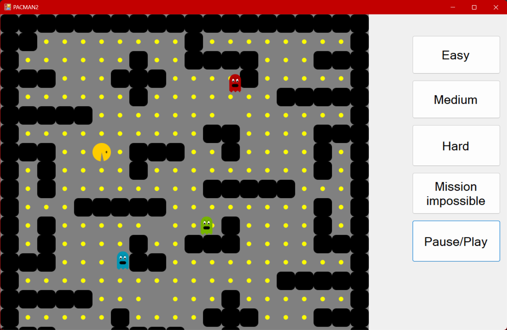

# PACMAN-game

This game was conceived as a voluntary school project, 
drawing inspiration from the well-known game Pac-Man. In this classic arcade experience, 
players guide a character through a maze to consume dots while avoiding ghosts.

